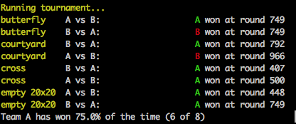

Orbitary Graph's Battlecode bot for 2018
========================================

Strategy considerations:

Mages with blink (together with some rangers that provide a good vision range) may be better than rangers, so it could be good to focus on rangers in the beginning of the game and switch to mages later on.

Research rockets so that we can leave no later than the flood. However, it's probably good to leave for Mars long before then, depending on the amount of resources available on Earth.

Potential rush strategy: Instead of building a factory near our starting position, let a worker go to the enemy and build it there instead. This way we can still build a good economy in the beginning of the game, while still being able to attack the enemy early.

Scripts
-------

The `./backup <tag>` script will create a backup of the current bot with the specified name.

`./run -b <tag>` will run a tournament against a bot with the specified tag. See `./run --help` for more options.
The output will look something like:

